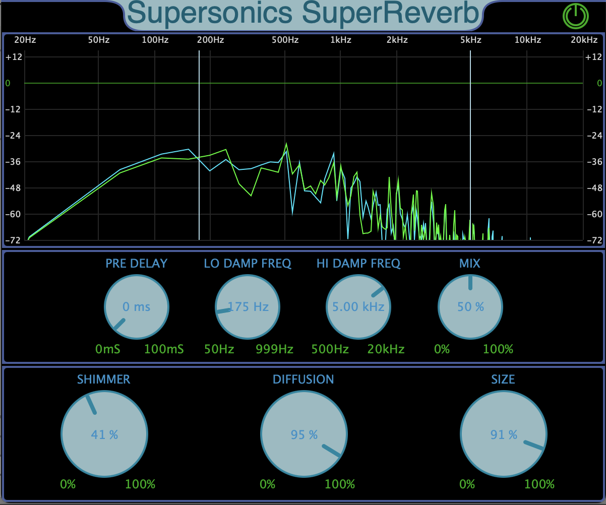

# Supersonics Audio Plugins

Welcome to Supersonics Audio<br><br>
Here you will find [code examples](code) of Supersonics Audio Plugins.
There are also links for [sound samples](https://www.youtube.com/@SupersonicsAudio) .<br>
TODO: Binaries for download
<br>
<p align="center">
 
</p>
<p align="center">
 
</p> 

## Plugins
* [Supersonics SuperReverb](#supersonics-superreverb)
* [WSOLAPitchShifter](#wsola-pitchshifter)
* [DynamicsShaper](#dynamicsshaper/gate)
* [TripleHead VintagePitchShifter](#tripleHead-VintagePitchShifter)

Tested in macOS intel (Sonoma 14.5), macOS m1 (Sonoma 14.5) and Intel Windows10 PC using Reaper as DAW.

## Supersonics SuperReverb
A plate-style reverb with shimmer control.

[Hear it in action](https://youtu.be/517ETR3p5vo).<br>
[](https://youtu.be/517ETR3p5vo) 
## WSOLA PitchShifter
A WSOLA-type pitch shifter. Preserves much of the orignal formants. Most efficient with monophonic signals like voice (speech) or single string instrument. 
Sounds good with polyphonics signals too.

[Hear it in action](https://youtu.be/-DjL_VXSGQc).<br>
[](https://youtu.be/-DjL_VXSGQc) 
## DynamicsShaper/Gate 
A classic ADSR processor. The ADSR is triggered when the signal reachs a treshold. 
User can modify the attack and decay of the instrument to make it sound like another.
Source code [here](code/Supersonics-DynamicsShaper).

[Hear it in action](https://youtu.be/rb3IziiWplQ).<br>
[](https://youtu.be/rb3IziiWplQ) 

## TripleHead VintagePitchShifter
Pitch shifter effect that makes use of the overlap-add scheme using three delay lines. User can select between two or three playback heads, the direction of the playback and the size of the processing block.

Some cancellations does exist during the cross-fades. This makes the sound throbbing or tremolo-like so formants are not preserved.
It is also an interesting effect when abused.
Source code [here](code/Supersonics-TripleHead-PitchShifter).

[Hear it in action](https://youtu.be/suXz9YRy8k0).<br>
[](https://youtu.be/suXz9YRy8k0) 


## Contact

```
supersonics@supersonicsaudio.com
```
